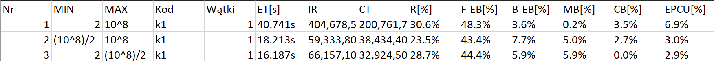

# Programowanie Równoległe - Liczby Pierwsze

Wersja pierwsza

### Autorzy

**Grupa dziekańska:** 4  
**Grupa labolatoryjna:** 7  
**Termin zajęć:** czwartek, 16:50

Tymoteusz Jagła 151811 - tymoteusz.jagla@student.put.poznan.pl  
Kaper Magnuszewski 151746 - kacper.magnuszewski@student.put.poznan.pl

### Sprawozdanie

_Wymagany termin oddania sprawozdania -_ 10.05.2024  
_Rzeczywisty termin oddania sprawozdania -_ 10.05.2024  

## Opis zadania

Projekt polegał na zbadaniu efektywności przetwarzania równoległego w komputerze z procesorem wielordzeniowym. Badanym zadaniem było znajdowanie liczb pierwszych w określonym zakresie. Podano różne warianty algorytmów - wyznaczanie liczb pierwszych metodą dzielenia oraz przy użyciu sita Erastothenes'a, w tym podejście sekwencyjne oraz równoległe (domenowe i funkcyjne).

## Wykorzystany system obliczeniowy

### Procesor

- Model: 13th Gen Intel® Core(TM) i5-13600KF
- Liczba procesorów fizycznych: 14
  - 6 Performance-cores
  - 8 Efficient-cores
- Liczba procesorów logicznych: 20
  - 2 wątki na pojedyńczy Performance-core
  - 1 wątek na pojedyńczy Effitient-core
- Oznaczenie typu procesora: KF
- Taktowanie procesora:
  - Minimalne: 800MHz
  - Maksymalne: 51000MHz
- Wielkości pamięci podręcznej procesora: 
  - L1d cache: 544 KiB (14 instancji)
  - L1i cache: 704 KiB (14 instancji)
  - L2 cache: 20 MiB (8 instancji)
  - L3 cache: 24 MiB (1 instancja)
- Organizacja pamięci podręcznej: Intel® Smart Cache

### System Operacyjny

- Nazwa systemu operacyjnego: Linux Pop!-OS 6.8.0
- Oprogramowanie wykorzystane do przygotowania kodu wynikowego: Visual Studio Code
- Oprogramowanie wykorzystane do przeprowadzenia testów: Intel VTune Profiler

## Wersje programów

### Zdefiniowane stałych używanych w kodzie
W osobnym pliku nagłówkowym zostały zdefiniowane stałe takie jak:
  - Dolna granica poszukiwania liczb pierwszych `M_VAL`
  - Górna granica poszukiwania liczb pierwszych `N_VAL`
  - Liczba procesorów użyta do wykonania zadania równolegle 

~~~ { #consts .cpp caption="Stałe używane w programach"}
#define M_VAL 2
#define N_VAL 1000000
#define THREADS_COUNT 8
#define BLOCKSIZE 8
~~~

### Liczby pierwsze wyznaczane sekwencyjnie przez dzielenie w zakresie $<m, n>$ (k1)
Poniższy kod to podejście sekwencyjne. Mierzony jest czas pracy procesora za pomocą zmiennych `spstart` i `spstop` oraz rzeczywisty czas pracy programu za pomocą `sswtime` i `sewtime`. Tablica `primeArray` przechowuje zmienne typu `bool` - pierwiastki liczby `n`, które są liczbami pierwszymi. Program metodą dzielenia wyznacza tablicę `primeArray`, po czym korzystając z wartości do niej wpisanych sprawdza wszystkie liczby z zakresu podanego w pliku nagłówkowym. Jeżeli dana liczba nie jest podzielna przez żaden z podzielników `n`, oznacza to, że jest to liczba pierwsza. W takim wypadku jest ona zapisywana do tablicy wynikowej `result`.

~~~ { #K1 .cpp .numberLines caption="Kod 1. Liczby pierwsze wyznaczane sekwencyjnie przez dzielenie"}

#include <math.h>
#include <omp.h>
#include <stdio.h>
#include <stdlib.h>
#include <string.h>
#include <time.h>

#include "consts.h"

int main(int argc, char *argv[]) {
  long int m = M_VAL, n = N_VAL;
  clock_t spstart, spstop;
  double sswtime, sewtime;

  bool *result = (bool *)malloc((n - m + 1) * sizeof(bool));
  memset(result, true, (n - m + 1) * sizeof(bool));

  bool *primeArray = (bool *)malloc((sqrt(n) + 1) * sizeof(bool));
  memset(primeArray, true, (sqrt(n) + 1) * sizeof(bool));

  sswtime = omp_get_wtime();
  spstart = clock();

  for (int i = 2; i * i <= n; i++) {
    for (int j = 2; j * j <= i; j++) {
      if (primeArray[j] == true && i % j == 0) {
        primeArray[i] = false;
        break;
      }
    }
  }

  for (int i = m; i <= n; i++) {
    for (int j = 2; j * j <= i; j++) {
      if (primeArray[j] == true && i % j == 0) {
        result[i - m] = false;
        break;
      }
    }
  }

  spstop = clock();
  sewtime = omp_get_wtime();
  printf("Dzielenie sekwencyjne:\n");
  printf("Czas procesorow przetwarzania sekwencyjnego: %f sekund\n",
         ((double)(spstop - spstart) / CLOCKS_PER_SEC));
  printf("Czas trwania obliczen sekwencyjnych - wallclock: %f sekund\n",
         sewtime - sswtime);
}
~~~

### Liczby pierwsze wyznaczane równolegle przez dzielenie w zakresie $<m,n>$ (k2)
Poniższy blok to równoległa implementacja kodu z poprzedniego zadania. W tym celu użyta została biblioteka `OpenMP`. W określonym obszarze równoległym, każdemu z wątków zostaje przydzielona wartość iteratora pętli `i`, który przyjmuje wartości w przedziale $<m, n>$. W tej wersji programu możemy ustawić różne wartości klauzuli `schedule`. Przy wartości `static` wątkom zostaną przydzielone różne liczby z zakresu $<m, n>$, co oznacza, że niektóre wątki zbadają mniej liczb niż inne, jeżeli badane liczby będą wyjątkowo duże. Ten przydział może okazać się niesprawiedliwy i wpłynąć na czas wykonywania programu.   
Jeżeli wątkom przydzielone zostałyby kolejne wartości `i` mógłby również wystąpić false-sharing. Oznacza to, że wątki mogłyby nadpisywać tą samą linię pamięci, co znacząco spowolniłoby program. W tym wypadku false-sharing pojawiłby się poprzez nadpisywanie części tablicy `result` znajdujących się w tych samych liniach pamięci.

~~~ { #K2 .cpp .numberLines caption="Kod 2. Liczby pierwsze wyznaczane równolegle przez dzielenie"}
#include <math.h>
#include <omp.h>
#include <stdio.h>
#include <stdlib.h>
#include <string.h>
#include <time.h>

#include "consts.h"

int main(int argc, char *argv[]) {
  long int m = M_VAL, n = N_VAL;
  clock_t ppstart, ppstop;
  double pswtime, pewtime;

  bool *result = (bool *)malloc((n - m + 1) * sizeof(bool));
  memset(result, true, (n - m + 1) * sizeof(bool));

  bool *primeArray = (bool *)malloc((sqrt(n) + 1) * sizeof(bool));
  memset(primeArray, true, (sqrt(n) + 1) * sizeof(bool));

  pswtime = omp_get_wtime();
  ppstart = clock();

  for (int i = 2; i * i <= n; i++) {
    for (int j = 2; j * j <= i; j++) {
      if (primeArray[j] == true && i % j == 0) {
        primeArray[i] = false;
        break;
      }
    }
  }

#pragma omp parallel num_threads(THREADS_COUNT)
  {
#pragma omp for
    for (int i = m; i <= n; i++) {
      for (int j = 2; j * j <= i; j++) {
        if (primeArray[j] == true && i % j == 0) {
          result[i - m] = false;
          break;
        }
      }
    }
  }

  ppstop = clock();
  pewtime = omp_get_wtime();

  printf("Dzielenie rownolegle\n");
  printf("Czas procesorow przetwarzania sekwencyjnego: %f sekund\n",
         ((double)(ppstop - ppstart) / CLOCKS_PER_SEC));
  printf("Czas trwania obliczen sekwencyjnych - wallclock: %f sekund\n",
         pewtime - pswtime);
}

~~~

### Sito sekwencyjne bez lokalności dostępu do danych (k3)
Poniższy kod to sekwencyjna implementacja algorytmu sita Erastothenesa. Pierwsza pętla programu ponownie wyznacza liczby pierwsze w zakresie $<2, n>$. Druga pętla identyfikuje liczby pierwsze w zakresie $<m, n>$ i oznacza jako liczby złożone ich wielokrotności. W ten sposób w tablicy wynikowej otrzymujemy jedynie liczby pierwsze.

~~~ { #K3 .cpp .numberLines caption="Kod 3. Sito sekwencyjne bez lokalności dostępu do danych"}
#include <math.h>
#include <omp.h>
#include <stdio.h>
#include <stdlib.h>
#include <string.h>
#include <time.h>

#include "consts.h"

int main(int argc, char *argv[]) {
  long int m = M_VAL, n = N_VAL;
  clock_t ppstart, ppstop;
  double pswtime, pewtime;

  bool *result = (bool *)malloc((n - m + 1) * sizeof(bool));
  memset(result, true, (n - m + 1) * sizeof(bool));

  bool *primeArray = (bool *)malloc((sqrt(n) + 1) * sizeof(bool));
  memset(primeArray, true, (sqrt(n) + 1) * sizeof(bool));

  pswtime = omp_get_wtime();
  ppstart = clock();

  for (int i = 2; i * i * i * i <= n; i++) {
    if (primeArray[i] == true) {
      for (int j = i * i; j * j <= n; j += i) {
        primeArray[j] = false;
      }
    }
  }

  for (int i = 2; i * i <= n; i++) {
    if (primeArray[i]) {
      int firstMultiple = (m / i);

      if (firstMultiple <= 1) {
        firstMultiple = i + i;
      } else if (m % i) {
        firstMultiple = (firstMultiple * i) + i;
      } else {
        firstMultiple = (firstMultiple * i);
      }

      for (int j = firstMultiple; j <= n; j += i) {
        result[j - m] = false;
      }
    }
  }

  ppstop = clock();
  pewtime = omp_get_wtime();

  printf("Sito sekwencyjne bez lokalności dostępu do danych\n");
  printf("Czas procesorow przetwarzania sekwencyjnego: %f sekund\n",
         ((double)(ppstop - ppstart) / CLOCKS_PER_SEC));
  printf("Czas trwania obliczen sekwencyjnych - wallclock: %f sekund\n",
         pewtime - pswtime);
}

~~~

### Sito sekwencyjne z potencjalną lokalnością dostępu do danych (k3a)
Poniższy kod przedstawia sekwencyjna implementację algorytmu sita Erastothenesa. Program został zmodyfikowany względem poprzednika. Została dodana lokalność dostępu do danych w oparciu o koncepcję lokalnego sita domenowego.

~~~ { #K3a .cpp .numberLines caption="Kod 3a. Sito sekwencyjne z potencjalną lokalnością dostępu do danych"}
#include <math.h>
#include <omp.h>
#include <stdio.h>
#include <stdlib.h>
#include <string.h>
#include <time.h>

#include "consts.h"

int main(int argc, char *argv[]) {
  long int m = M_VAL, n = N_VAL;
  clock_t ppstart, ppstop;
  double pswtime, pewtime;
  int blockSize = BLOCKSIZE;

  bool *result = (bool *)malloc((n - m + 1) * sizeof(bool));
  memset(result, true, (n - m + 1) * sizeof(bool));

  bool *primeArray = (bool *)malloc((sqrt(n) + 1) * sizeof(bool));
  memset(primeArray, true, (sqrt(n) + 1) * sizeof(bool));

  pswtime = omp_get_wtime();
  ppstart = clock();

  for (int i = 2; i * i * i * i <= n; i++) {
    if (primeArray[i] == true) {
      for (int j = i * i; j * j <= n; j += i) {
        primeArray[j] = false;
      }
    }
  }

  int numberOfBlocks = (n - m) / blockSize;
  if ((n - m) % blockSize != 0) {
    numberOfBlocks++;
  }

  int low = m + blockSize;
  int high = m + blockSize + blockSize;
  if (high > n) {
    high = n;
  }

  for (int i = 0; i < numberOfBlocks; i++) {
    for (int j = 2; j * j <= high; j++) {
      if (primeArray[j]) {
        int firstMultiple = (low / j);
        if (firstMultiple <= 1) {
          firstMultiple = j + j;
        } else if (low % j) {
          firstMultiple = (firstMultiple * j) + j;
        } else {
          firstMultiple = (firstMultiple * j);
        }
        for (int k = firstMultiple; k <= high; k += j) {
          result[k - m] = false;
        }
      }
    }
  }

  ppstop = clock();
  pewtime = omp_get_wtime();

  printf("Sito sekwencyjne bez lokalności dostępu do danych\n");
  printf("Czas procesorow przetwarzania sekwencyjnego: %f sekund\n",
         ((double)(ppstop - ppstart) / CLOCKS_PER_SEC));
  printf("Czas trwania obliczen sekwencyjnych - wallclock: %f sekund\n",
         pewtime - pswtime);
}

~~~

### Sito równoległe funkcyjne bez lokalności dostępu do danych (k4)
Poniższy kod to równoległa implementacja poprzedniego zadania znajdowania liczb pierwszych przy użyciu algorytmu sita Erastothenes'a. W podanym algorytmie występuje brak lokalności dostępu do danych, co spowodowane jest możliwością odczytywania przez wątki komórek tablicy `result`, które dzielą tą samą linię cache (występuje false-sharing). Działanie programu może zostać przez to znacząco spowolnione.

~~~ { #K4 .cpp .numberLines caption="Kod 4. Sito równoległe funkcyjne bez lokalności dostępu do danych"}
#include <math.h>
#include <omp.h>
#include <stdbool.h>
#include <stdio.h>
#include <stdlib.h>
#include <string.h>
#include <time.h>

#include "consts.h"

int main() {
  long int m = M_VAL, n = N_VAL;
  clock_t ppstart, ppstop;
  double pswtime, pewtime;

  bool *result = (bool *)malloc((n - m + 1) * sizeof(bool));
  memset(result, true, (n - m + 1) * sizeof(bool));

  bool *primeArray = (bool *)malloc((sqrt(n) + 1) * sizeof(bool));
  memset(primeArray, true, (sqrt(n) + 1) * sizeof(bool));

  pswtime = omp_get_wtime();
  ppstart = clock();

  for (int i = 2; i * i * i * i <= n; i++) {
    if (primeArray[i] == true) {
      for (int j = i * i; j * j <= n; j += i) {
        primeArray[j] = false;
      }
    }
  }

  int sqrtn = sqrt(n);

#pragma omp parallel for num_threads(THREADS_COUNT)
  for (int i = 2; i <= sqrtn; i++) {
    if (primeArray[i]) {
      int firstMultiple = (m / i);

      if (firstMultiple <= 1) {
        firstMultiple = i + i;
      } else if (m % i) {
        firstMultiple = (firstMultiple * i) + i;
      } else {
        firstMultiple = (firstMultiple * i);
      }

      for (int j = firstMultiple; j <= n; j += j) {
        result[j - m] = false;
      }
    }
  }

  ppstop = clock();
  pewtime = omp_get_wtime();

  printf("Sito równoległe funkcyjne bez lokalności dostępu do danych\n");
  printf("Czas procesorow przetwarzania sekwencyjnego: %f sekund\n",
         ((double)(ppstop - ppstart) / CLOCKS_PER_SEC));
  printf("Czas trwania obliczen sekwencyjnych - wallclock: %f sekund\n",
         pewtime - pswtime);
}

~~~

### Sito równoległe funkcyjne bez lokalności dostępu do danych (k4a)
Jest to implementacja kodu z zadania poprzedniego, w której dodatkowo sprawdzana jest wartość tablicy `result` w komórce, do której program chciałby wpisać wartość `false`. Oznacza to, że możemy uniknąć wielu nadmiernych unieważnień pamięci oraz ograniczyć ilość prób niepotrzebnych zmian wartości tablicy wynikowej.

~~~ { #K4a .cpp .numberLines caption="Kod 4a. Sito równoległe funkcyjne bez lokalności dostępu do danych"}
#include <math.h>
#include <omp.h>
#include <stdbool.h>
#include <stdio.h>
#include <stdlib.h>
#include <string.h>
#include <time.h>

#include "consts.h"

int main() {
  long int m = M_VAL, n = N_VAL;
  clock_t ppstart, ppstop;
  double pswtime, pewtime;

  bool *result = (bool *)malloc((n - m + 1) * sizeof(bool));
  memset(result, true, (n - m + 1) * sizeof(bool));

  bool *primeArray = (bool *)malloc((sqrt(n) + 1) * sizeof(bool));
  memset(primeArray, true, (sqrt(n) + 1) * sizeof(bool));

  pswtime = omp_get_wtime();
  ppstart = clock();

  for (int i = 2; i * i * i * i <= n; i++) {
    if (primeArray[i] == true) {
      for (int j = i * i; j * j <= n; j += i) {
        primeArray[j] = false;
      }
    }
  }

  int sqrtn = sqrt(n);

#pragma omp parallel for
  for (int i = 2; i <= sqrtn; i++) {
    if (primeArray[i]) {
      int firstMultiple = (m / i);

      if (firstMultiple <= 1) {
        firstMultiple = i + i;
      } else if (m % i) {
        firstMultiple = (firstMultiple * i) + i;
      } else {
        firstMultiple = (firstMultiple * i);
      }

      for (int j = firstMultiple; j <= n; j += j) {
        if (result[j - m])
          result[j - m] = false;
      }
    }
  }

  ppstop = clock();
  pewtime = omp_get_wtime();

  printf("Sito równoległe funkcyjne bez lokalności dostępu do danych\n");
  printf("Czas procesorow przetwarzania sekwencyjnego: %f sekund\n",
         ((double)(ppstop - ppstart) / CLOCKS_PER_SEC));
  printf("Czas trwania obliczen sekwencyjnych - wallclock: %f sekund\n",
         pewtime - pswtime);
}

~~~

### Sito równoległe domenowe z potencjalną lokalnością dostępu do danych (k5)
Poniższy kod również przedstawia algorytm sita Erastothenesa, jednak dodatkowo stosuje taktykę podziału obszaru roboczego na bloki. Dzięki takiemu rozwiązaniu możemy uniknąć false sharingu, a co za tym idzie znacznie przyspieszyć wykonywanie się programu. Najlepszy efekt osiągniemy, jeżeli wielkość bloku dostosujemy do długości linii pamięci. Dzięki temu unikniemy niepotrzebnych odczytów w linii pamięci przez różne wątki, a co za tym idzie jej unieważniania. 

  **Kod 5. Sito równoległe domenowe z potencjalną lokalnością dostępu do danych***
~~~ { #K5 .cpp .numberLines caption="Kod 5. Sito równoległe domenowe z potencjalną lokalnością dostępu do danych"}
#include <math.h>
#include <omp.h>
#include <stdio.h>
#include <string.h>
#include <time.h>

#include "consts.h"

int main() {
  long int m = M_VAL, n = N_VAL;
  clock_t ppstart, ppstop;
  double pswtime, pewtime;

  bool *result = (bool *)malloc((n - m + 1) * sizeof(bool));
  memset(result, true, (n - m + 1) * sizeof(bool));
  bool *primeArray = (bool *)malloc((sqrt(n) + 1) * sizeof(bool));
  memset(primeArray, true, (sqrt(n) + 1) * sizeof(bool));

  pswtime = omp_get_wtime();
  ppstart = clock();

  int blockSize = BLOCKSIZE;
  int numberOfBlocks = (n - m) / blockSize;
  if ((n - m) % blockSize != 0) {
    numberOfBlocks++;
  }
#pragma omp parallel for num_threads(THREADS_COUNT)
  for (int i = 0; i < numberOfBlocks; i++) {
    int low = m + i * blockSize;
    int high = m + i * blockSize + blockSize;
    if (high > n) {
      high = n;
    }
    for (int j = 2; j * j <= high; j++) {
      if (primeArray[j]) {
        int firstMultiple = (low / j);
        if (firstMultiple <= 1) {
          firstMultiple = j + j;
        } else if (low % j) {
          firstMultiple = (firstMultiple * j) + j;
        } else {
          firstMultiple = (firstMultiple * j);
        }
        for (int k = firstMultiple; k <= high; k += j) {
          result[k - m] = false;
        }
      }
    }
  }

  ppstop = clock();
  pewtime = omp_get_wtime();

  printf(
      "Sito równoległe domenowe z potencjalną lokalnością dostępu do danych\n");
  printf("Czas procesorow przetwarzania rownoleglego: %f sekund\n",
         ((double)(ppstop - ppstart) / CLOCKS_PER_SEC));
  printf("Czas trwania obliczen rownoleglych - wallclock: %f sekund\n",
         pewtime - pswtime);
}

~~~

## Wyniki eksperymentu
Aby przeprowadzić eksperyment obliczeniowo-pomiarowy, wykorzystaliśmy funkcję "Microarchitecture Exploration" dostępną w programie Intel VTune. Ta funkcja umożliwia analizę efektywności przetwarzania. W ramach tego trybu zbierane są dane podczas działania procesora za pomocą jednostek monitorujących wydajność.  
Programy sekwencyjne zostały uruchomione jednokrotnie, a ich równoległe odpowiedniki w dwóch wariantach. Z racji, że procesor posiada 6 Performance-cores oraz 8 Efficient-cores postanowiliśmy uruchomić program dla ograniczonej części rdzeni typu Performance (Nie jesteśmy jednak pewni jakich rdzeni procesor używa w danym momencie, gdyż nie zostało to opisane), czyli dla 4 procesorów oraz dla połowy maksymalnej liczby procesorów logicznych, która wynosi 10.  

Przetwarzane przez nas przedziały, to:
  - $<2, MAX>$, gdzie $MAX = 10^8$
  - $<2, MAX / 2>$, gdzie $MAX = 10^8$
  - $<MAX / 2, MAX>$, gdzie $MAX = 10^8$

Wykorzystane w tabelach oznaczenia:
  * Czas przetwarzania - Elapsed Time w VTune wyrażony w sekundach
  * Instructions Retired (IT) - liczba wywoływanych instrukcji kodu asemblera
  * ClockTicks (CT) - liczba cykli procesorów w trakcie wykonywania kodu
  * Ograniczenie wejścia (F-EB) - udział procentowy w ograniczeniu efektywności przetwarzania części wejściowej procesora
  * Ograniczenie wyjścia (B-EB) - udział procentowy w ograniczeniu efektywności przetwarzania części wyjściowej procesora
  * Ograniczenie systemu pamięci (MB) - udział procentowy w ograniczeniu efektywności przetwarzania systemu pamięci
  * Ograniczenie jednostek wykonawczych (CB) - udział procentowy w ograniczeniu efektywności przetwarzania jednostek wykonawczych procesora
  * Efektywne wykorzystanie rdzeni fizycznych procesora - procentowe wykorzystanie dostępnych zasobów w postaci rdzeni procesora

### Liczby pierwsze wyznaczane sekwencyjnie poprzez dzielenie oraz metodą sita (k1, k3, k3a)
W poniższej tabeli znajdują się wyniki przetwarzania dla metod sekwencyjnych.

  ***Tabela 1: Tabela wartości parametrów dla algorytmu k1***

  ***Tabela 2: Tabela wartości parametrów dla algorytmu k3***

  ***Tabela 3: Tabela wartości parametrów dla algorytmu k3a***

Z powyższych tabeli wynika, że algorytm wyznaczający liczby pierwsze metodą sekwencyjną sposobem dzielenia jest 30 razy wolniejszy od algorytmu sita Erastothenesa. Jesteśmy w stanie uzyskać jeszcze lepsza wydajność stosując lokalność dostępu do danych, co widzimy w tabeli 3. Algorytm ten jest około 164 razy szybszy od sposobu dzielenia oraz około 5 razy szybszy od zwykłego sita. Wyniki te zostały uzyskane dla obliczeń w zakresie $<2, MAX>$. Dodatkowo możemy zauważyć, że ograniczenie systemu pamięci znacząco się zmniejsza w przypadku wersji kodu `k3a`.

### Liczby pierwsze wyznaczane równolegle poprzez dzielenie oraz metodą sita (k2, k4, k4a, k5)
W poniższej tabeli znajdują się wyniki przetwarzania dla metod równoległych podejściem funkcyjnym (`k2`, `k4`, `k4a`) oraz domenowym (`k5`).

  ***Tabela 4: Tabela wartości parametrów dla algorytmu k2***

  ***Tabela 5: Tabela wartości parametrów dla algorytmu k4***

  ***Tabela 6: Tabela wartości parametrów dla algorytmu k4a***

  ***Tabela 7: Tabela wartości parametrów dla algorytmu k5***

W tabelach 4, 5 oraz 6 zostało wykorzystane podejście funkcyjne. Oznacza to, że procesy otrzymują całą tablicę wykreśleń i fragment zbioru liczb pierwszych, których wielokrotności są usuwane. W tym podejściu najlepszy czas uzyskaliśmy przy użyciu 10 wątków dla instancji $<2, 10^8>$ algorytmu sita równoległego `k4a`. Czas ten jest około 273 razy mniejszy od najdłuższego czasu wykonywania, należącego do metody dzielenia równoległego (`k2`) oraz około 2 razy mniejszy od czasu wykonywania algorytmu `k4`. Najszybszy z algorytmów wykazuje się jednak znaczącym zwiększeniem ograniczenia systemu pamięci.

Porównując powyżej opisane wyniki do podejścia domenowego, gdzie procesy otrzymują fragment tablicy wykreśleń i całą tablicę liczb
pierwszych możemy zauważyć znacznie lepsze wykorzystanie rdzeni procesora. Jest to przedstawione w kolumnie `EPCU`. Dodatkowo zaobserwowany został zmniejszony narzut pamięci w stosunku do podejścia funkcyjnego. Nie zostały jednak zauważone zmniejszone czasy wykonywania algorytmów. 

Zbadaliśmy różne warianty szeregowania pętli for i mimo lepszego wykorzystania wątków w szeregowaniu dynamic, lepsze czasy osiągnęliśmy stosując szeregowanie guided.

### Podsumowanie wyników
Podsumowując możemy zauważyć około 6-krotne przyspieszenie działania dla algorytmu równoległego względem sekwencyjnego wykorzystującego dzielenie do obliczenia liczb pierwszych z zakresu $<2, 10^8>$.

Równoległy algorytm wykorzystujący sito Erastothenes'a osiągnął czas około 36 razy lepszy od wariantu sekwencyjnego dla instancji problemu szukającego liczb pierwszych w zakresie $<2, 10^8>$.

## Wnioski
Zauważyliśmy, że we wszystkich obliczeniach występuje niska efektywność zużycia wątków procesora. We wszystkich przypadkach ilość wykorzystanych wątków była mniejsza lub równa ilości rdzeni typu Performance procesora. Podejrzewamy, że jest to spowodowane nietypową architekturą nowych procesorów firmy Intel (Rysunek 1).

  ***Rysunek 1: Efektywność zużycia wątków procesora***

Najszybciej efektywnym podejściem równoległym okazało się w naszym eksperymencie podejście domenowe. Algorytm ten nie jest najszybszy ze wszystkich badanych, jednak zapewnia najlepsze wykorzystanie rdzeni procesora dla wszystkich badanych instancji (zarówno dla 4 jak i 10 wątków). Ograniczenia, które mogą wpływać na efektywność, to duża liczba komunikacji i synchronizacji.

Największą prędkością wyznaczania liczb pierwszych w podanym zakresie $<m, n>$ okazał się być algorytm `k4a`. Jest to algorytm sita równoległego funkcyjnego zmodyfikowany odpowiednio, aby uniknąć nadmiernych unieważnień pamięci. 